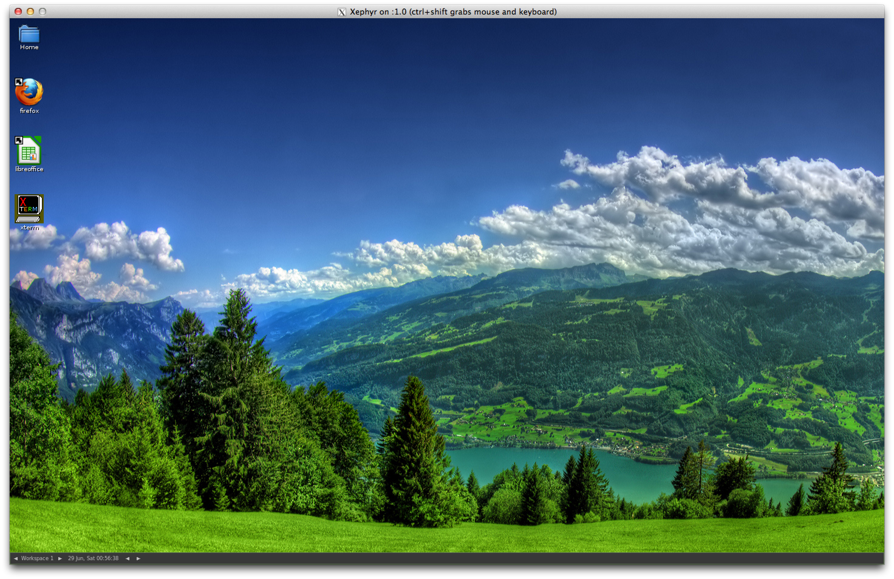

DOCKER-DESKTOP
==============

## Description

This Dockerfile creates a docker image and once it's executed it creates a container that runs X11 and SSH services.
The ssh is used to forward X11 and provide you encrypted data communication between the docker container and your local machine.

Xpra + Xephyr allows to display the applications running inside of the container such as Firefox, LibreOffice, xterm, etc. with recovery connection capabilities. Xpra also uses a custom protocol that is self-tuning and relatively latency-insensitive, and thus is usable over worse links than standard X.

The applications can be rootless, so the client machine manages the windows that are displayed.

Fluxbox and ROX-Filer creates a very minimalist way to manages the windows and files. 




OBS: The client machine needs to have a X11 server installed (Xpra). See the "Notes" below. 

## Docker Installation

### On Ubuntu:
Docker is available as a Ubuntu PPA (Personal Package Archive), hosted on launchpad which makes installing Docker on Ubuntu very easy.

```
#Add the PPA sources to your apt sources list.
sudo apt-get install python-software-properties && sudo add-apt-repository ppa:dotcloud/lxc-docker
 
# Update your sources
sudo apt-get update
 
# Install, you will see another warning that the package cannot be authenticated. Confirm install.
sudo apt-get install lxc-docker
```
### On Windows:
Requirements:
- Installation Tutorial (http://docs.docker.io/en/latest/installation/windows/)

### On Mac OS X:
Requirements:
- Installation Tutorial (http://docs.docker.io/en/latest/installation/vagrant/)

## Installation


### Building the docker image

```
$ docker build -t rogaha/docker-desktop git://github.com/rogaha/docker-desktop.git

OR

$ git clone https://github.com/rogaha/docker-desktop.git
$ cd docker-desktop
$ docker build -t [username]/docker-desktop .
```

### Running the docker image created (-d: detached mode, -P: expose the port 22 on the host machine)

```
$ CONTAINER_ID=$(docker run -d -P [username]/docker-desktop)
```

### Getting the password generated during runtime

```
$ echo $(docker logs $CONTAINER_ID | sed -n 1p)
User: docker Password: xxxxxxxxxxxx
# where xxxxxxxxxxxx is the password created by PWGen that contains at least one capital letter and one number
```

## Usage

### Getting the container's external ssh port 

```
$ docker port $CONTAINER_ID 22
49153 # This is the external port that forwards to the ssh service running inside of the container as port 22
```

### Connecting to the container 

#### Starting the a new session 

```
$ ifconfig | grep "inet addr:" 
inet addr:192.168.56.102  Bcast:192.168.56.255  Mask:255.255.255.0 # This is the LAN's IP for this machine

$ ssh docker@192.168.56.102 -p 49153 "sh -c './docker-desktop -s 800x600 -d 10 > /dev/null 2>&1 &'" # Here is where we use the external port
docker@192.168.56.102's password: xxxxxxxxxxxx 

$ ./docker-desktop -h

-----------------------------------------------------------
Usage: docker-desktop [-s screen_size] [-d session_number]
-s : screen resolution (Default = 800x600
-d : session number (Default = 10)
-h : help
-----------------------------------------------------------
```

#### Attaching to the session started

```
$ xpra --ssh="ssh -p 49153" attach ssh:docker@192.168.56.102:10 # user@ip_address:session_number
docker@192.168.56.102's password: xxxxxxxxxxxx 

```
If you want to execute rootless programs, you just need to connect to the container via ssh and type: 
DISPLAY=:[session_number] [program_name] & 

Eg. DISPLAY=:10 firefox &

## Notes

### On Windows:
Requirements:
- Xpra <= 14.0 (https://www.xpra.org/dists/windows/)
- Path: C:\Program Files(x86)\Xpra\Xpra_cmd.exe

### On OS X:
Requirements:
- Xpra Version <= 14.0 (https://www.xpra.org/dists/osx/x86/)
- Path: /Applications/Xpra.app/Contents/Helpers/xpra


### On Linux:
Requirements:
- Xpra: You can use apt-get to install it -> apt-get install xpra
- Path: /usr/bin/xpra
